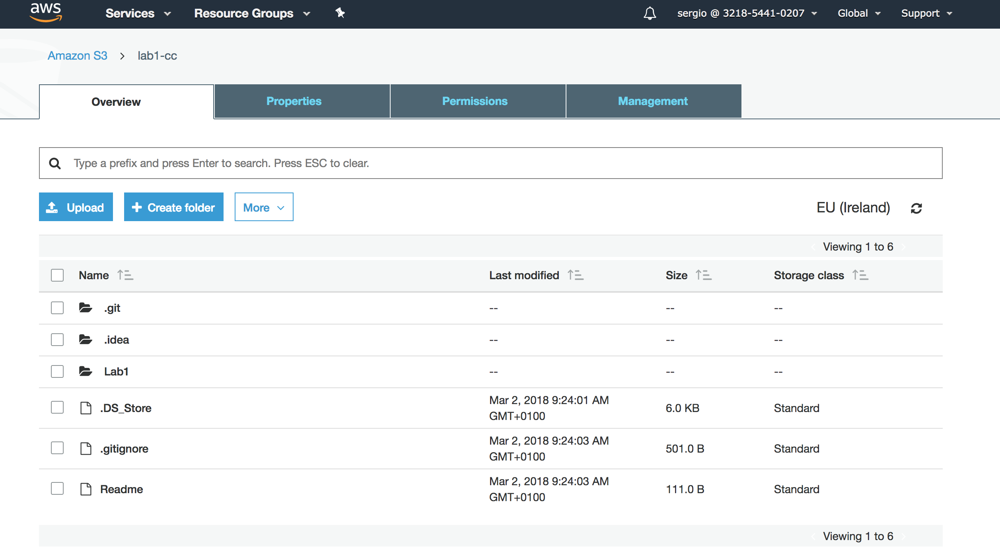
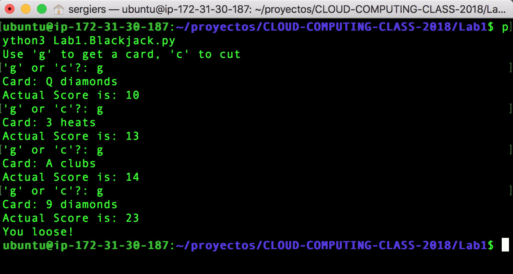

# CLOUD-COMPUTING-CLASS-2018
 
* Sergio Ruiz: __sergiers@opendeusto.es__
* Dagoberto Herrera: __dagobertoherreramurillo@live.com__

This is a simplified version of the BlackJack game.
It uses random to merge the deck and then, the dealer tries to beat you.
Dealer's algorithm is quite simple, since you put a tolerance and it tries to get a score as close as 21 based on 1-tolerance

The python version used in this project was 3.5 

